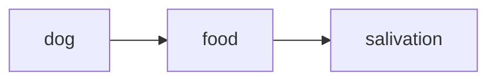
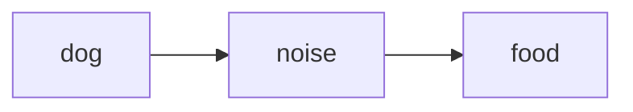

***

First, the dog had innate, unconditional, food-related respones:

```mermaid
flowchart LR

dog --> food --> salivation
```

Then, Pavlov exposed the dog to repeated pairings of a tone and food:

```mermaid
flowchart LR

dog --> noise --> food
```
